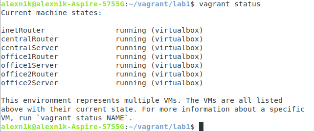
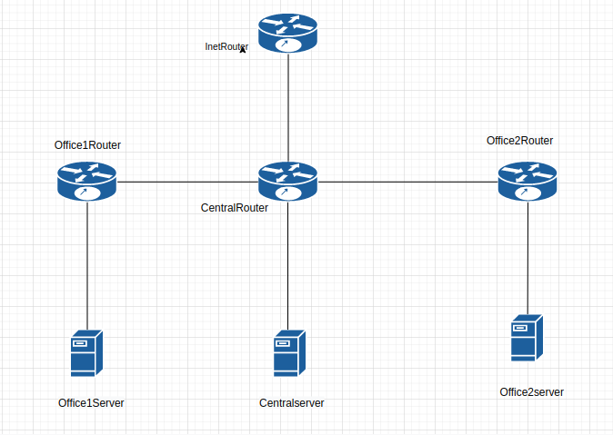
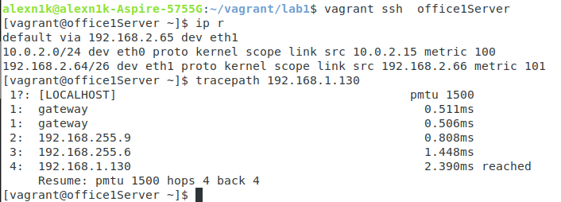
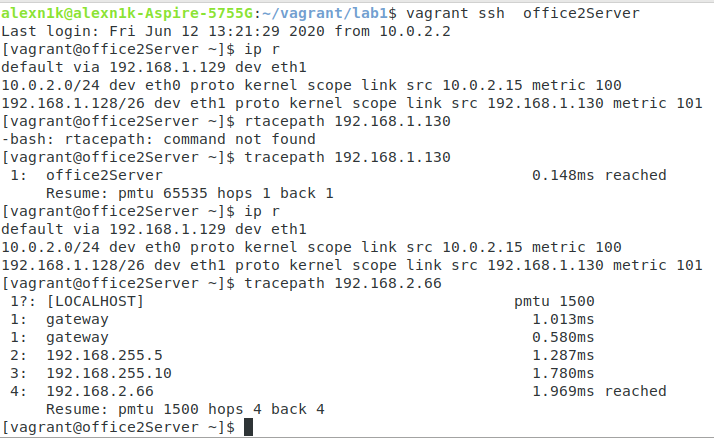
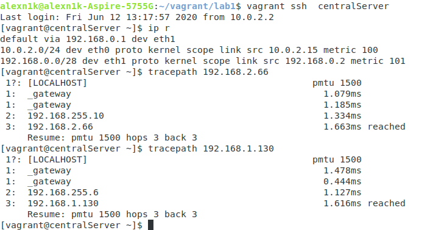
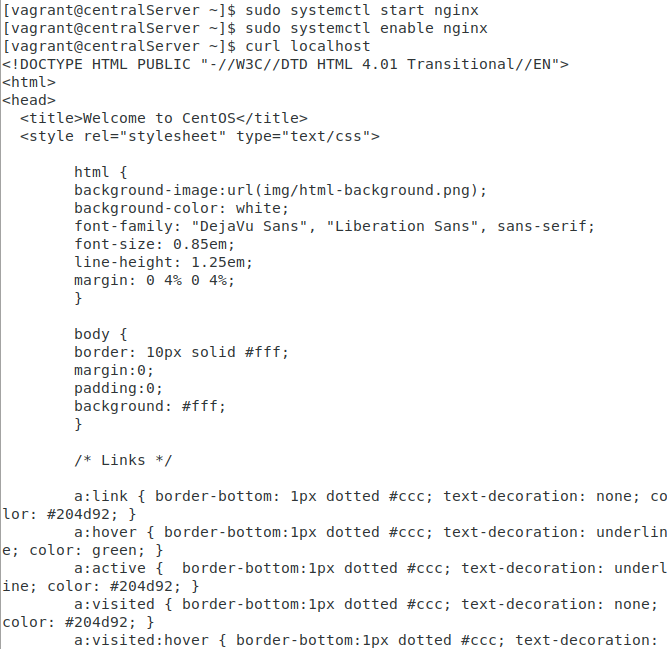

# Лабораторная работа 1

## задание 1
### разобрать структуру нарисовать схему сети

## задание 2

### Первая сеть
Подсети:

#### 192.168.2.0/26
Узлов: 62
Broadcast: 192.168.2.63

#### 192.168.2.64/26
Узлов: 62
Broadcast: 192.168.2.127

#### 192.168.2.128/26
Узлов: 62
Broadcast: 192.168.2.191

### Вторая сеть
Подсети:

#### 192.168.1.0/25
Узлов: 126
Broadcast: 192.168.1.127

#### 192.168.1.128/26
Узлов: 62
Broadcast: 192.168.1.191

#### 192.168.1.192/26
Узлов: 62
Broadcast: 192.168.1.255

### Третья сеть
Подсети:

#### 192.168.0.0/28
Узлов: 14
Broadcast: 192.168.0.15

## задание 3
### office1Server

### office2Server

### centralServer

## Задание 4
### Nginx

###  Блокировка запроса на 80 порт

